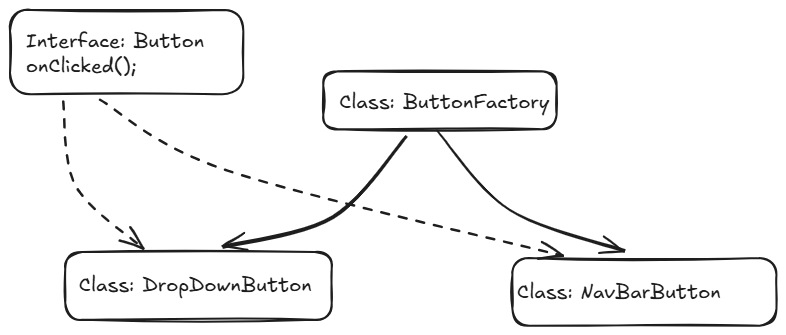

# Factory Pattern

### Definition

Defines an interface for creating an object, but let subclasses decide which class to instantiate. The Factory method lets a class defer instantiation to the subclasses 

### Example: Button Factory 

#### Problem

Let us design a UI heavy application, one that uses a large number of Buttons, in different pages within the application. Here a naive approach would be to instantiate a new Button at every location, pass the relevant configs if needed. 

Code Example:  

```java
public interface Button {
    String color;
    void onClicked();
}

class NavBarButton implements Button{
    // Implementation code 
}
class DropDownButton implements Button{
    // Implementation code 
}
class UI {
    public void display(){
        // navbar
        homeElement.add(new NavBarButton(color: "blue"));
        // new button for every option in the navbar

        // dropdown
        for(Options o: dropDownOptions) {
            o.addElement(new DropDownButton(color: "red")); // new button on every dropdown option
        }

    }
}
```
But this comes with the significant disadvantages such as:

1. If we need to modify the UI every button would need to be independently modified (due to their individual instantiation using the `new` keyword).  
2. There is massive code duplication  
3. There is little consistency in the code in how new buttons are created.  
4. The overall code is also very difficult to maintain as it violates the DRY principles  
   

A simple solution is to centralize the logic of object creation into a factory method or an object.

#### Solution using the Factory Pattern:

We define a class `ButtonFactory` that encapsulates the creation logic. Based on the given input it then returns the right subclass.

#### Implementation details:




```java
class ButtonFactory {
    public static Button createButton(String type) {
        if(type.equals("navBar")) return new NavBarButton(color: "blue");
        if(type.equals("dropDown")) return new DropDownButton(color:"red");
        return new Button(color:"green");
    }
}

class UI {
    public void display(){
        Factory buttonFactory = new ButtonFactory();
        // navbar
        homeElement.add(buttonFactory.createButton("navBar"));

        // dropdown
        for(Options o: dropDownOptions) {
            o.addElement(buttonFactory.createButton("dropDown")); 
            // Because the object creation is now centralized to the Factory, we can easly maintain and modify the code.
            // Additionally this allows us to follow the open/ close principle more thoroughly by making the UI class closed to changes.
        }

    }
}
```

### Key Concepts:

**Encapsulation of Object Creation**
The client no longer needs to know how to instantiate specific subclasses.

**Centralized Configuration**
Changing button behavior (like setting default size, style) can be done in one place the factory.

**Composition over Inheritance**
Factory decides which subclass to instantiate based on provided data.

**DRY Principle**
No more repeating instantiation logic all over the code.

**Helper Pattern**
The Factory Pattern acts as a clean helper for object creation.

### Code
