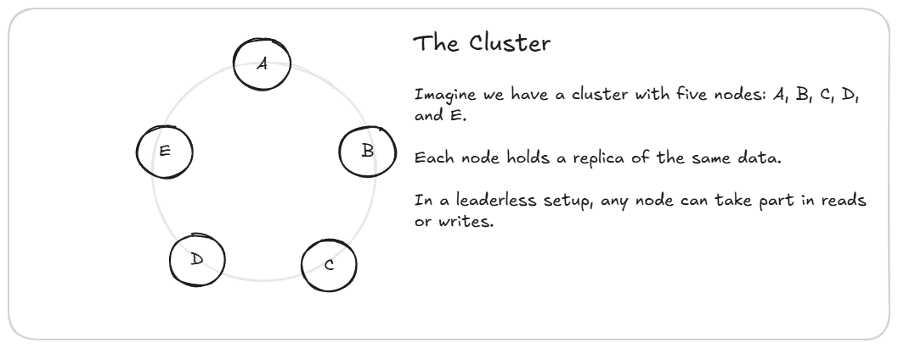

# Distributed Systems Deep Dive: Leaderless replication

In this blog, we will take a deep dive into leaderless replication, it's concepts, and the commonly used algorithms.

## What is Leaderless replication?
It is a replication schema that enables users to connect to any node and perform Read/ Write operations (as there is no primary/ leader elected). 
This approach is commonly seen in very large scale distributed databases like Apache Cassandra.

Traditional databases generally rely on a leader node to coordinate reads and writes. Leaderless replication distributes the responsibility across multiple nodes to improve throughput, availability, and fault tolerance.

Keywords:

- **Strong Consistency**: Aka read after write consistency, it guarantees that following a successful write, all reads agree on the value being read from the database

- **Tunable Consistency**: Algorithms that allow for tuning or adjusting the level of consistency (usually by tuning parameters withing the algorithm)

- **Eventual Consistency**: Algorithms that guarantee that given no new updates after a successful write to a specific row, all nodes in the cluster will eventually agree on the new value

- **Quorum**: Minimum number of acknowledgements that an event must receive for it to be valid

- **Hinted Handoff**: Technique to improve the system availability by routing updates to backup cluster when the primary cluster is down then forwarding these changes to the primary cluster once it's up

Core Concepts in Leaderless Replication: 

1. **Read repair**: When a client reads from a set of nodes and detects a stale value from a sub set, it then requests the stale nodes to update themselves.

2. **Anti-Entropy**:

    Anti-Entropy algorithms aim to reduce the differences or the `entropy` between two nodes by comparing data and patching up any differences, essentially getting both nodes into the same state (synchronizing them).

    Cassandra achieves this is using a Merkle tree in gossip rounds. 

    Note: Merkle trees are binary hash trees that are used to capture the state of a large data structure, commonly used in blockchain as well as databases

However, both read repair and anti-entropy are time consuming algorithms falling under the broader umbrella of eventually consistent models. They do not provide strong consistency.

## Approaching Strong Consistency:

While not giving us the mathematical proofs guaranteeing strong consistency, quorums bring us very close. 

### Quorums

In this model, a client must write to some W nodes (have a write quorum) for the write to be successful and must read from some R nodes (have a read quorum) for the read to be successful. 

As long as R + W >  N (N is the total number of nodes), we can guarantee that there will be an overlap with at least one node with the latest data.

Example: 

Let's say that our dummy cluster has 5 (A, B, C, D, and E)nodes with a read and write quorum being 3 nodes each.

 - All nodes have an initial value for some row X as 5

 - Client I writes to nodes A, B, and C, updating X to 10. After receiving their acknowledgements and confirming a write quorum, it considers the write to be successful even though the write has yet to pass to the entire cluster (D and E) 

 - Client II reads from nodes D and E (stale values) and then from A, B, or C (updated values).

 - Client II will then update D and E to the new value, performing a read repair.

| **Condition**      | **Consistency Strength**                   | **Availability** | **Example (N = 5)**  |
| ------------------ | ------------------------------------------ | ---------------- | -------------------- |
| **R + W ≤ N**      | **Weak / Eventual Consistency**         |  **High**      | R=2, W=2             |
| **R + W = N + 1**  | **Tunable / Near-Strong Consistency**   |  **Balanced**  | R=3, W=3             |
| **R + W > N**      | **Strong (Quorum) Consistency**         |  **Lower**     | R=4, W=2 or R=3, W=3 |
| **R = N or W = N** | **Strict / Linearizable (Theoretical)** |  **Lowest**    | R=5, W=1 or R=1, W=5 |

### Coordinator Nodes

A coordinator node is the node exposed to the client. Making read/ write requests on behalf of clients, performing read repairs as needed.

Its primary function is to simplify the client-side interfaces and logic.

But unlike leader-based replication schemas (RAFT), these nodes do not enforce linearizability of any kind, which makes the system more vulnerable to race conditions in concurrent writes.

### Shortcomings of quorums

1. Race Conditions:

    - Let's say that 5 people write to our dummy cluster, each person writing to a different node. This effectively causes a thundering herd problem with each node flooding the network, trying to get a quorum for its values

    - This causes a race condition as now the system behavior is non-deterministic. Different sets of R nodes might agree on different values (each value is considered equally fresh as it was written at the same time) 

2. Write Failures:

    - Let's say that in our example, the write to node A fails, client 1 is satisfied as it had a write quorum, but client II can read from the subset B, C, D have a read quorum and still read a wrong value

3. Sloppy Quorum:

    - When a cluster in a region fails, we can start routing writes to some other region. Now, when the original cluster comes back online, the client can have a read quorum on it, but still get stale data as it is looking at the old cluster

    - The solution to this is to use a Hinted Handoff

4. Write Amplification

    - The coordinator node must make W writes, which puts more load on the network and potentially causes congestion and increases latency

5. Non-Linearizability

    - Leaderless replication simply does not support linearization. This holds true regardless of R and W values

    - LWW depends on the clock synchronization, but on a very large cluster sized clock drift potentially happens casting doubt on the degree of trust in a node's local time

6. Latency and overhead

    - Read and Write latency relies on the slowest node in the quorum

    - We have to wait for these nodes to complete the quorum, even if faster nodes have already responded.
