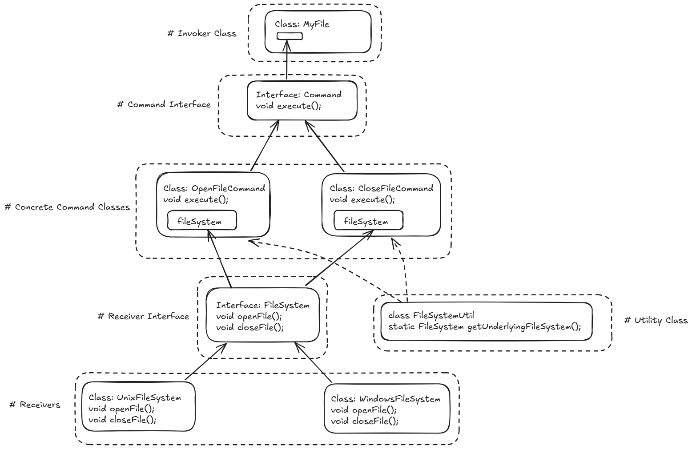

# Command Pattern

### Definition

The **Command Pattern** encapsulates a request as an object, thereby allowing you to parameterize clients with different requests, queue or log requests, and support undoable operations.

This decouples the object that invokes the operation from the one that knows how to perform it, enabling flexible and extensible software design.

### Example: Cross-Platform File Manager

Let us design a simple file manager that works on both Windows and Unix-based systems.  
The system has 3 main components:

1. The **Receiver** (`WindowsFileSystem`, `UnixFileSystem`) which implements platform-specific file operations like `openFile()` and `closeFile()`.  
2. The **Command** objects (`OpenFileCommand`, `CloseFileCommand`) that encapsulate the actions and interact with the appropriate receiver.  
3. The **Invoker** (`FileInvoker`) that triggers the command without knowing what action is being performed or how.

#### Problem

We want to design a file manager that can open and close files regardless of the operating system it is running on.

The code must be flexible enough to:
- Switch platforms dynamically.
- Add new commands (like delete, rename, compress) without modifying the existing flow.
- Reuse the same `Invoker` without being tied to specific commands or receivers.

The invoker should not need to know *how* the file is opened or closed; it should only trigger the appropriate command.

#### Solution using the Command Pattern:

We split the problem as follows:

- The **Receiver** (`FileSystem` interface and its implementations):  
  - Knows how to perform OS-specific file operations.
  - Implements `openFile()` and `closeFile()` methods.
  
- The **Command Interface & Concrete Commands** (`OpenFileCommand`, `CloseFileCommand`):  
  - Encapsulate the request to perform an action.
  - Call the appropriate method on the receiver.
  
- The **Invoker** (`FileInvoker`):  
  - Holds a command and simply calls `execute()` on it.
  
- The **Client**:  
  - Decides which receiver and command to use and assigns it to the invoker.

From this decomposition we gain:

1. The **Invoker** doesn't need to know what operation it's executing — only that it has a `Command`.  
2. We can add more commands (rename, move, copy) without changing any existing code.  
3. Receivers can vary (Windows vs Unix) without impacting commands or the invoker.

#### Implementation Flow details:

**Receiver:**

- The `FileSystem` interface defines file actions (`openFile`, `closeFile`).
- Platform-specific classes like `WindowsFileSystem` and `UnixFileSystem` implement these actions.

**Command:**

- A `Command` interface declares an `execute()` method.
- `OpenFileCommand` and `CloseFileCommand` hold a reference to the receiver and call its methods during execution.

**Invoker:**

- The `FileInvoker` class holds a `Command` object and calls its `execute()` method.
- This is the only thing the invoker does — it knows nothing about receivers or logic.

**Client:**

- Gets the current OS.
- Chooses the correct `FileSystem` implementation.
- Creates command objects and sets them in invokers.
- Calls `execute()` on invokers.

### Key Concepts:

* **Encapsulation of Requests**: Each operation (open, close, etc.) is wrapped in a `Command` object.  
* **Decoupling**: The invoker is decoupled from both the action and the platform logic.  
* **Extensibility**: Adding new commands or platforms doesn’t require modifying existing classes.  
* **Queue/Log Support**: Commands can be stored for later execution or for undo functionality.  
* **Dynamic Binding**: The command and receiver are selected at runtime by the client.

### [Code](./Command.java)
