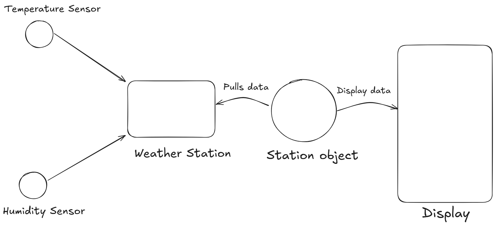
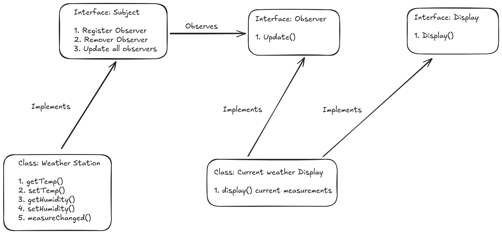

# Observer Pattern

### Definition

The Observer Pattern defines a one-to-many dependency between objects so that when one object changes state, all of its dependents are notified and updated automatically. 

### Example: Weather Monitoring Station

Let us design a Weather Monitoring system.   
The System has 3 components:

1. The Weather Station (physical device which gets data from the actual sensors. Sensors include: Temperature and Weather)  
2. Weather data object (Tracks and updates the data coming from the station)
3. The display which shows the current conditions.

#### Problem

The station object should update the displays whenever there is any change in the weather data. Each display should be able to register and unregister itself from the object. Beyond this, we want the ability to select and customize the display at run time (ie, we don’t know the exact working and parameters the display will have).  
The System should also be open to any changes that we want to make over time. Ie. it should be maintainable and expandable.

#### Solution using the Observer Pattern:

First we split the problem into two parts along with the scope of the overall problem:

- The Station Object (`Subject`):  
  - Register new displays.  
  - Provide functionality to unregister a display.  
  - Pull data from the station, update all displays.  
- The Displays (`Observer`):  
  - Receive updates from the station.  
  - Display received updates.  
  - Be customizable.

From this split we can make certain important observations:

1. The only thing the `Subject` (Weather Station Object) needs to know is that the `Observer` implements its corresponding interface.   
- That is, the Subject is essentially completely decoupled from the Observer, this means that we can have a great deal of flexibility in terms of the actual `implementation` of the Displays.  
2. Each `Observer` is independent of each other.   
- Each observer can have vastly different implementations so long as each `Observer` implements the appropriate interface.  
3. As `Observers` can register and unregister themselves anytime, the `Subject` should be able to account for any number of `Observers` without making any changes to itself.

#### Implementation Flow details:

`Subject:`

- The weather station object has getters and setters for all the tracked parameters (temperature and humidity).  
- The sensors use these to update the values within the `Observer`.   
- The `Observer` then either periodically or on each update calls the `update()` method on all registered displays to update them on the current value of the parameters (In our implementation the `update()` method has no parameters, the `Subjects` call the getter for each parameter individually. This is great if a large number of updatable parameters - exist within the `Observer` but in case of smaller or more frequently tracked parameters it might be a good idea to just send those parameters directly into the `update()` method)

`Observer:`

- Upon object creation each station is given a reference of the `Subject`. The `Observer` the uses this reference to call the `.register()` method within the subject and register itself for receiving further updates.  
- When the `Observer` has an update, it calls the `.update()` function of each registered object.  
- After being notified, each `Observer` then gets the parameter it is tracking/ displaying and shows them on the Display.

### Key Concepts:

* **One-to-Many Relationship**: A single subject (observable) notifies multiple observers when its state changes.  
* **Loose Coupling**: The subject knows *only* that observers implement a common interface; it doesn't depend on their concrete implementation.  
* **Push vs Pull**:  
  * *Push*: Subject sends data directly in the `update()` method.  
  * *Pull*: Observers receive a generic update call and query the subject for the data they need (using the getter functions).  
* **Dynamic Subscription**:  
  * Observers can register/unregister themselves at runtime.  
  * The subject maintains a list of observers internally.  
* **Extensibility**:  
  * New observers or changes to existing ones do not require changes to the subject.

### [Code](./Observer_pattern.java)