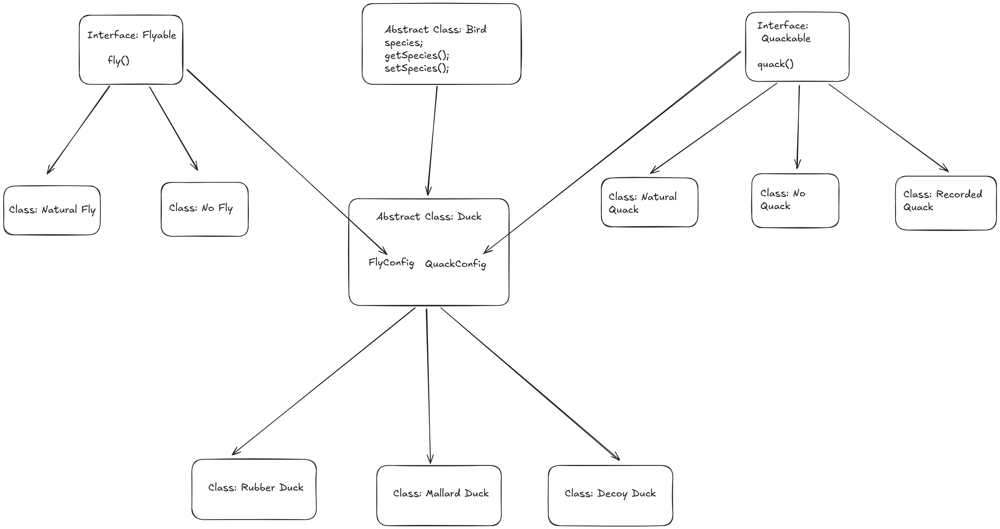

# Strategy Pattern

### Definition

The Strategy Pattern defines a family of algorithms, encapsulates each one, and makes them interchangeable. Strategy lets the algorithm vary independently from clients that use it.

### Example:  Duck Simulator

Let us design a duck simulator. Since we are working with several types of ducks (mallard, decoy, rubber ducks)  we want to build a system where addition of new behavior and duck types is easy.  
That is, we want the system to easily accommodate a mallard duck, a decoy duck as well as a rubber duck. Along with the various behaviors these ducks may have. While making future maintenance and modification easy.

Problem: If we choose to implement the `fly()` and `quack()`behaviors for each type of `Duck` (inheriting from the abstract class). In this case each Duck is forced to override these methods, even if the behavior is identical.   
This causes the following issues:

1. makes the code difficult to maintain  
2. unnecessary code duplication  
3. Modification is difficult as any changes to `Duck` are globally applied to every duck object.

Solution using the Strategy pattern:

We define a family of algorithms, breaking out the `flying` and `quacking` behavior into separate families of algorithms. Each family is encapsulated under the its own behavioural Interface (Flyable and Quackable respectively)

Every particular behavior is implemented under its own concrete class:  
Flyable: `Natural Fly`, `No Fly`,   
Quackable: `Natural Quack`, `Recorded Quack` and so on.

The abstract `Duck` is now delegating its behaviors into the fields:

- `FlyConfig` of type `Flyable`  
- `QuackConfig` of type `Quackable`

These Concrete classes can then be slotted into a Duck object at run time under the FlyConfig and the QuackConfig class members.  
This approach ensures that behaviors may be added, modified without impacting the Duck class or any of the other behaviors.

### Key Concepts:

1. **Delegation over inheritance** Here we give more preference to HAS-A relationships instead of IS-A relationships. This makes the code more flexible than what is allowed by inheritance  
2. **Encapsulation of each family of algorithms** Each Algorithm (Behavior) is encapsulated into its own class, under the umbrella of that interface.  
3. **Interchangeability**: Because each behavior class implements the same interface, the client (duck) can change a duck’s behavior without changing code at run time.  
4. **Object Composition** A duck (object) is “composed of” certain behaviors, where each ‘behavior’ is a separate class implementing that behavior's interface.  
5. **Open/ Closed Principle** New behaviors can be added without modifying any of the existing behaviors

### [Code](./Strategy.java)